# 📦 Sortieranlage mit Förderband & 3 Ausschiebern  
### Grundkurs SPS – Aufgabe 7 (TIA Portal, FUP)

Dieses Projekt zeigt die vollständige Umsetzung einer Sortieranlage in **Siemens TIA Portal** mit **FUP‑Programmierung**.  
Pakete werden erkannt, zeitverzögert transportiert und über drei Ausschieber gleichmäßig verteilt.  
Alle Netzwerke sind dokumentiert und als Screenshots beigefügt.

---

## 🚀 Funktionsübersicht

### ▶️ Start / Stop / Not‑Aus
- Start über **Taster_Start**
- Stop oder Not‑Aus schalten die Anlage sofort ab
- **Leuchte_Start** und **Leuchte_Stop** zeigen den Anlagenzustand an

### 🔄 Paketablauf
1. Paket wird am Einlauf erkannt  
2. Nach **1 Sekunde** Einschaltverzögerung startet das Förderband  
3. Paketverteilung über CTU‑Zähler:
   - 1. Paket → Ausschieber 1  
   - 2. Paket → Ausschieber 2  
   - 3. Paket → Ausschieber 3  
   - Danach wieder bei 1  
4. Jeder Ausschieber fährt aus, sobald sein Lichttaster belegt ist  
5. Nach dem Abtransport stoppt das Förderband automatisch  
6. Es liegt immer nur **ein Paket gleichzeitig** auf dem Band

---

# 🧩 Netzwerke im Detail

### Netzwerk 2 – Start/Stop/Not‑Aus
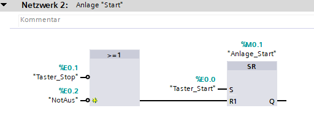  
SR-Logik für Anlagenstart. Stop oder Not-Aus setzen die Anlage zurück.

### Netzwerk 3 – Förderband mit TON
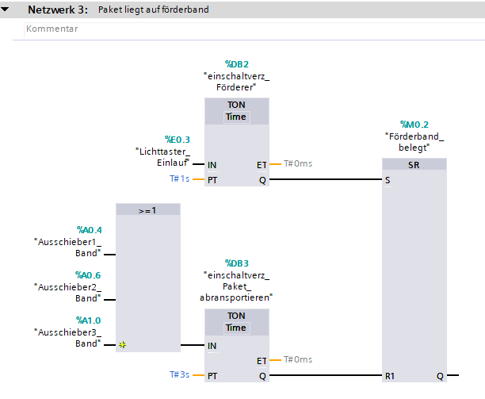  
TON-Timer sorgt für 1s Einschaltverzögerung. Danach wird „Förderband_belegt“ gesetzt.

### Netzwerk 4 – Ausschieber 1 ansteuern
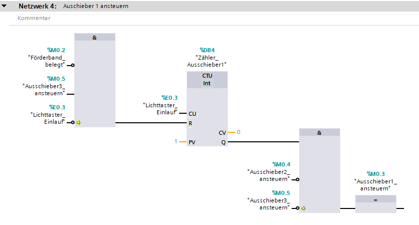  
CTU zählt Pakete. Wenn Zählerstand = 1 → Ausschieber 1 wird aktiviert.

### Netzwerk 5 – Ausschieber 2 ansteuern
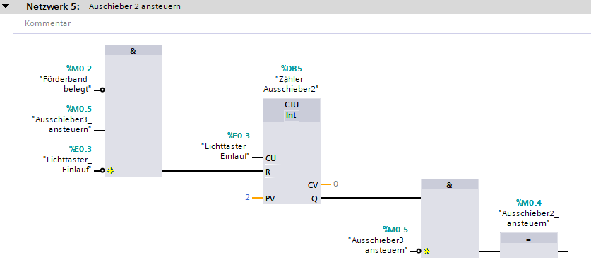  
Wenn Zählerstand = 2 → Ausschieber 2 wird aktiviert.

### Netzwerk 6 – Ausschieber 3 ansteuern
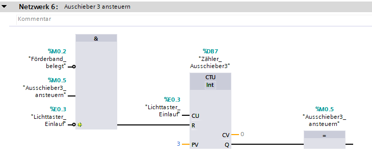  
Wenn Zählerstand = 3 → Ausschieber 3 wird aktiviert. Danach Reset → Zyklus beginnt neu.

### Netzwerk 7 – Leuchte Start
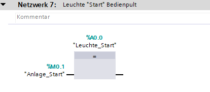  
Grüne Leuchte zeigt: Anlage läuft.

### Netzwerk 8 – Leuchte Stop
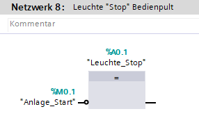  
Rote Leuchte zeigt: Anlage gestoppt.

### Netzwerk 9 – Motor Förderband
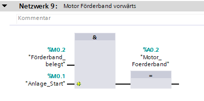  
Förderband läuft nur, wenn Anlage gestartet und Förderband belegt ist.

### Netzwerk 10 – Ausschieber 1 ausfahren + Band
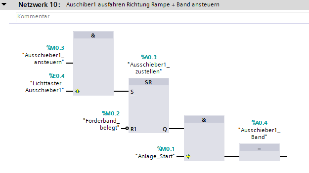  
Ausschieber 1 fährt aus, Band 1 läuft während des Ausschiebens.

### Netzwerk 11 – Ausschieber 2 ausfahren + Band
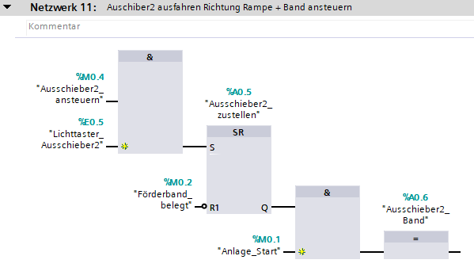  
Ausschieber 2 fährt aus, Band 2 läuft während des Ausschiebens.

### Netzwerk 12 – Ausschieber 3 ausfahren + Band
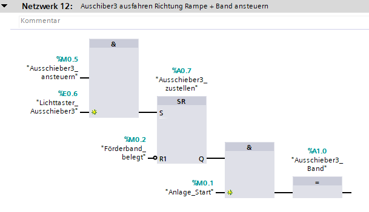  
Ausschieber 3 fährt aus, Band 3 läuft während des Ausschiebens.

---

## 📘 PLC-Variablentabelle
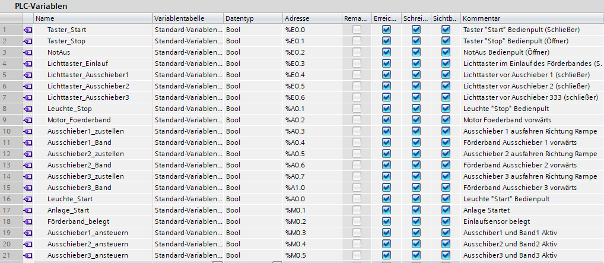  
Alle verwendeten Eingänge, Ausgänge und Merker sind hier dokumentiert.

---

## 🎯 Ziel des Projekts
- Grundlagen der SPS‑Programmierung festigen  
- Arbeiten mit FUP, TON, CTU und SR  
- Realistische Sortierlogik umsetzen  
- Dokumentation für GitHub & Portfolio

---

## 🛠️ Hinweis
Dieses Projekt wurde bewusst in **FUP** umgesetzt.  
Eine spätere Erweiterung in **SCL** (z. B. mit Zustandsautomaten) ist möglich.
